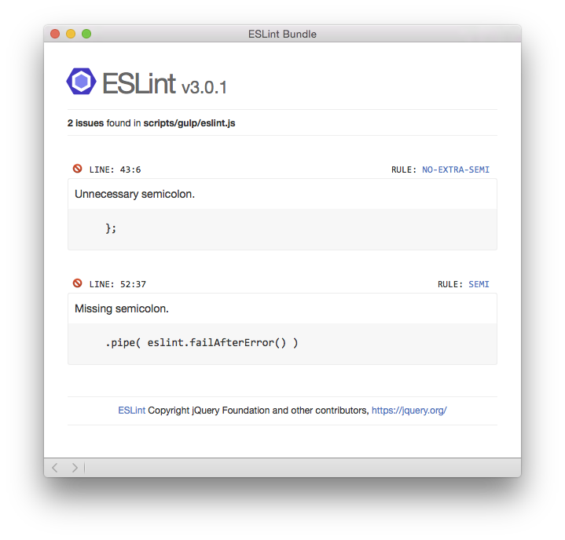
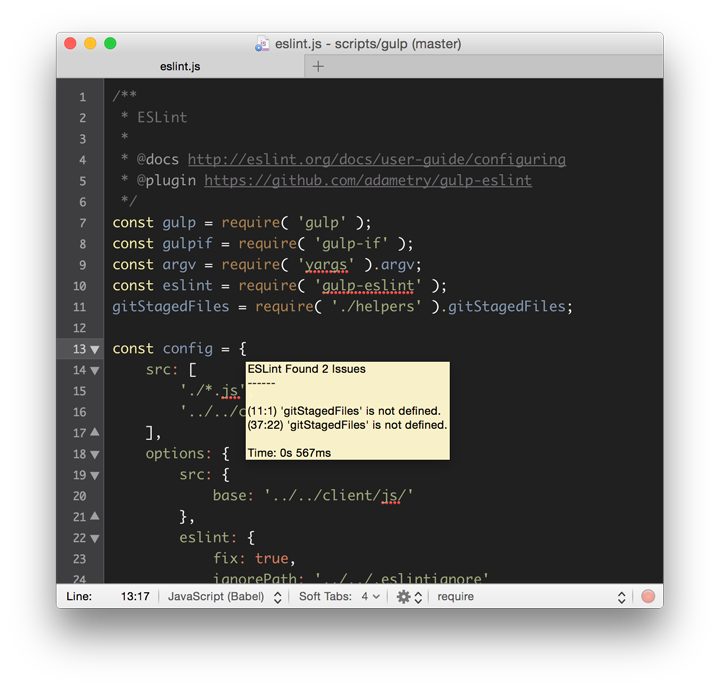

# ESLint Bundle for Textmate #

Lint your JavaScript files with [ESLint](http://eslint.org).

Download latest [version](https://github.com/ryanfitzer/eslint.tmbundle/releases/latest).






## Features ##

- **`⌘S`** Lints the current document on save and shows errors via an unobtrusive tooltip (no tooltip is shown for warnings).

- **`^L`** Lints the current document and shows a formatted results view, which includes:

    - The ESLint version in use.
    - The issue severity ("warn" ⚠️ vs. "error" 🚫️).
    - A link to the documentation for the rule related to the issue.
    - The ability to focus the cursor back to the line and column where the issue originated:
        
        - Clicking the issue source.
        - Pressing the number associated with the issue.

- Uses your project's local `eslint` package. This enables you to lint with the version of ESLint specific to each project.

- Configurable per project via `.tm_properties`.


## Requirements ##

- [NodeJS](https://nodejs.org) >= v6.x.x is installed.

- ESLint >= v5.x.x.

- `PATH` variable in **Textmate** > **Preferences** > **Variables** should be enabled and properly configured to include `/usr/bin` (the plugin looks for the `node` executable via `#!/usr/bin/env node`).

- ESLint installed your project's `node_modules` directory (customizable via `TM_eslint_path` [option](#tm_eslint_path))


## Commands ##

- **Lint** `⌃L`: Lints current document and shows issues in new window.

- **Lint on Save** `⌘S`: Lints current document and shows errors in a tooltip.

- **Help** `^⇧L`: Shows `README.md` in new window.

- **Debug** `^H`: Shows bundle debugging information in new window.

**Experimental**

- **Enable Live Lint** `^⌘L`: The same as **Lint** `⌃L`, but auto-refreshes on document changes (as long a the results view stays open).


## Options ##

TextMate will look for a `.tm_properties` file in the project's root directory and in any parent folders (up to the user’s home folder). You can use the following properties to customize ESLint.


### `TM_eslint_path` ###

  - Type: `String`
  - Default: `./node_modules/eslint`

Path to `eslint` package. Must include a "package.json" file.

Example:

```
TM_eslint_path = './path/to/node_modules/eslint'
```


### `TM_eslint_config_file` ###

  - Type: `String`
  - Default: `null`

Path to the configuration file to use.

Example:

```
TM_eslint_config_file = 'path/to/config.js'
```


### `TM_eslint_base_config_file` ###

  - Type: `String`
  - Default: `null`

Path to base configuration file. Only `*.js` or `*.json` extensions are currently supported (file is loaded using `require`, therefore `*.yaml` and files with no extension are not currently supported).

Example:

```
TM_eslint_base_config_file = 'path/to/base/base-config.js'
```


### `TM_eslint_use_eslintrc` ###

  - Type: `Boolean`
  - Default: `true`

Set to `false` to disable use of `.eslintrc*` files.

Example:

```
TM_eslint_use_eslintrc = false
```


### `TM_eslint_fix` ###

  - Type: `Boolean`
  - Default: `false`

Output fixes source for errors and warnings that ESLint can fix. All rules in the [documentation](http://eslint.org/docs/rules) that show a wrench icon are fixable.

Example:

```
TM_eslint_eslint_fix = true
```


### `TM_eslint_ignore_path` ###

  - Type: `String`
  - Default: `null`

Use a non-default ignore file. From [Ignoring Files and Directories](http://eslint.org/docs/user-guide/configuring#ignoring-files-and-directories):

> When ESLint is run, it looks in the current working directory to find an `.eslintignore` file before determining which files to lint. If this file is found, then those preferences are applied when traversing directories. Only one `.eslintignore` file can be used at a time, so `.eslintignore` files other than the one in the current working directory will not be used.

Example:

```
TM_eslint_ignore_path = 'path/to/ignore/file'
```


### `TM_eslint_ignore_pattern` ###

  - Type: `String`
  - Default: `null`

Comma separated list of glob patterns.

Example:

```
TM_eslint_ignore_pattern = 'first/pattern, second/pattern'
```


### `TM_eslint_cwd` ###
  
  - Type: `String`
  - Default: `$TM_PROJECT_DIRECTORY`
  
Path to a directory that should be considered as the current working directory.

Example:

```
TM_eslint_cwd = 'path/to/project'
```


### `TM_eslint_disable_on_save` ###

  - Type: `Boolean`
  - Default: `false`
  
Disable the the "Lint on Save" command.

Example:

```
TM_eslint_disable_on_save = true
```


### `TM_eslint_debug` ###

  - Type: `Boolean`
  - Default: `false`
  
Show any errors caught while trying to load or configure the ESLint `CLIEngine`.

Example:

```
TM_eslint_debug = true
```
